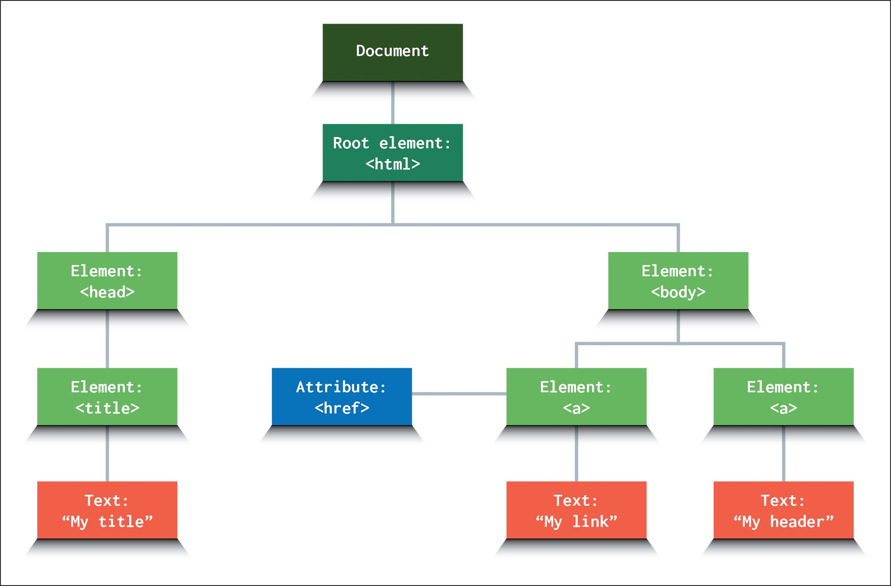
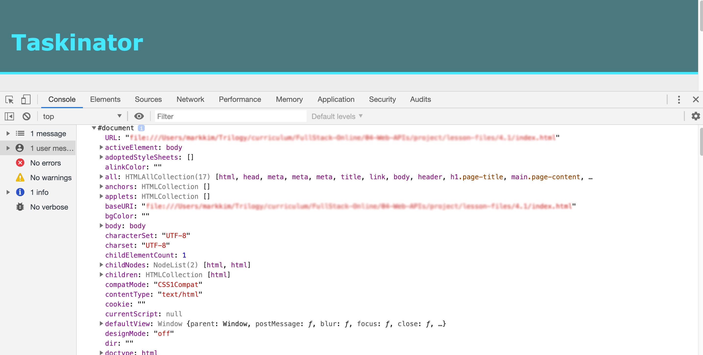

# task-it

## User Story
As a USER, I want to be able to create a task, edit it, and delete it. 

## Deployed Links
> [Github](https://github.com/njacques47/task-it)   
> [Github Deployment](https://njacques47.github.io/task-it/)

----------------------

## Notes

### DOM Elements
DOM = representation of HTML on the page. HTML code is read like a `document` within the window object (document is also an object as well). We can use `JS` to target certain aspects of the document. 

>The `Document Object Model (DOM)` is the object representation of the root element of a webpage, which is the HTML document, all other elements are descendant (aka child elements) of the document. 
Here is a visual example of the DOM object tree: 
Once the document is selected, we can access all the descendant objects to interact with using `JS`.     

#### Interacting with the DOM

By dynamically generating HTML and dynamically styling, new elements can be created and attached to the page and maintain styling.

### Event Handlers & Listeners

Event `handlers` is the response to a specific event while event `listeners` are waiting to see that an event has occured. 

> for example, this is a block of code that targets the `button` element by adding an `event listner` to wait for a "click" to happen. When that click happens, a window alert is then generated as a `event handler`.
```javascript
buttonEl.addEventListener("click", function() {
  alert("button clicked");
});
```  

### Callback Functions

A `callback` acts as a way to ensure one function is fully processed before another one runs by passing an argument into another function.    
To execute a callback repeatedly at a set interval, we would use a `setInterval` and then a `setClear` to stop the process (loop).   
`setTimeout` will execute a callback after a delay